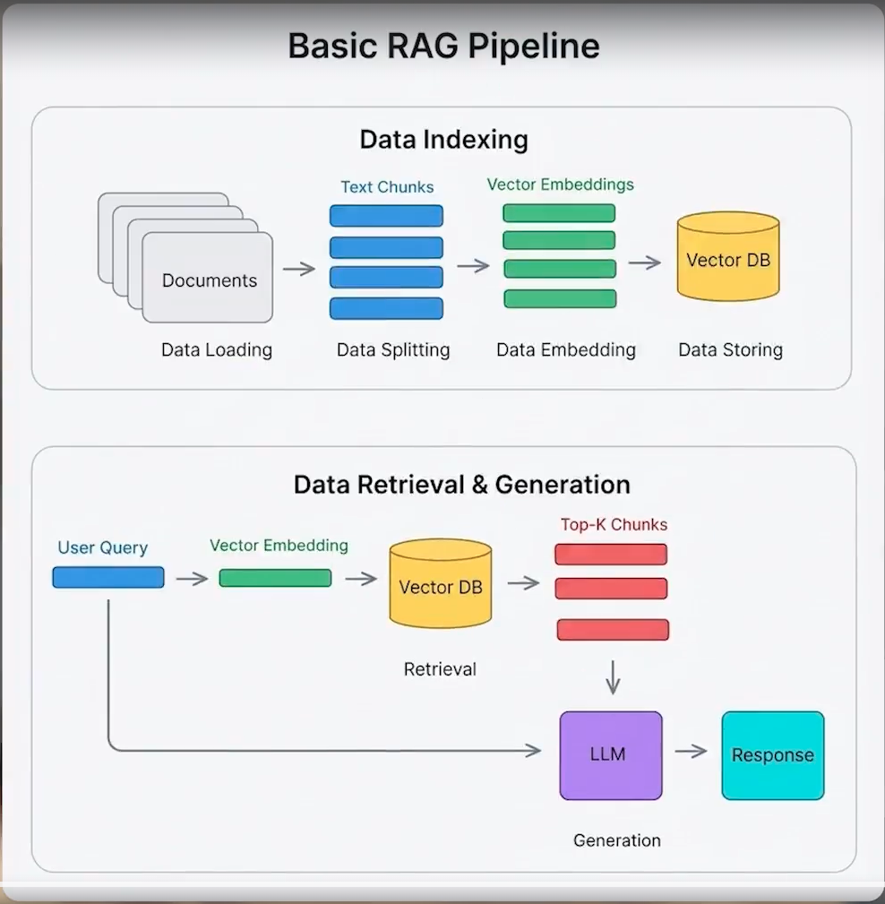

# LangChain System

Ein Lern- und Experimentierprojekt rund um LangChain.js: ein RAG-Agent, der Fragen
zur LangChain-Dokumentation beantwortet und seine Quellen nennt, dazu eine
Ingestion-Pipeline, ein kleines Web-Chat-UI und die [Fabrik](factory/README.md) —
ein LangGraph-Graph, der Features mit Claude-Code-Workern durch den SDLC schickt.



## Überblick

```
docs.langchain.com ──Firecrawl──▶ ingestion.ts ──Ollama-Embeddings──▶ Chroma
                                                                        │
Browser ──▶ Angular (4200, iframe) ──▶ Express (8008) ──▶ core.ts (ReAct-Agent)
                                                            │
                                                     Ollama (qwen3:1.7b)
```

| Teil | Datei | Was er tut |
|---|---|---|
| Agent | `src/core.ts` | ReAct-Agent mit einem Retriever-Tool auf Chroma (`k: 6`). Exportiert `agent` (für LangGraph Studio) und `runLlm()`. |
| Ingestion | `src/ingestion.ts` | Pipeline A: `sample.txt` über Unstructured laden, splitten, Pinecone anbinden. Pipeline B: `docs.langchain.com` mit Firecrawl crawlen, in 800-Zeichen-Chunks splitten und in Chroma (`collection-1`) schreiben. |
| Spielwiese | `src/index.ts` | Experimente: Tool-Calling-Agent mit Tavily, manuelle Agent-Schleife mit LangSmith-Tracing, Retrieval-Chain mit und ohne LCEL auf Pinecone. |
| Server | `src/server.js` | Express + EJS auf Port 8008. `GET /` liefert das Chat-UI, `POST /api/llm` nimmt `{ "question": "..." }` und antwortet mit `{ content, metadata }` (Quell-URLs). |
| Frontend | `frontend/` | Angular-19-App, die das Chat-UI des Servers per iframe einbettet. |
| Fabrik | `factory/` | Eigenständiges Paket, siehe [factory/README.md](factory/README.md). |
| Logger | `src/logger.ts` | Farbige Konsolenausgabe (`logInfo`, `logSuccess`, `logHeader`, …). |

## Voraussetzungen

- Node.js (ESM, TypeScript 7)
- [Ollama](https://ollama.com) auf `localhost:11434` mit den Modellen:
  ```bash
  ollama pull qwen3:1.7b
  ollama pull mxbai-embed-large
  ```
- Docker für Chroma, Unstructured und optional Firecrawl/Langfuse
- Für Firecrawl und Langfuse werden die Compose-Dateien in den Nachbarordnern
  `../firecrawl` und `../langfuse` erwartet.

## Einrichtung

```bash
npm install
npm --prefix ./frontend install
```

Eine `.env` im Projektwurzelverzeichnis anlegen (wird nicht eingecheckt):

| Variable | Wofür |
|---|---|
| `PROD` | `true` schaltet die ausführlichen `console.dir`-Ausgaben ab |
| `ANTHROPIC_API_KEY`, `GROQ_API_KEY` | alternative Chat-Modelle in `index.ts` |
| `LANGSMITH_TRACING`, `LANGSMITH_ENDPOINT`, `LANGSMITH_API_KEY`, `LANGSMITH_PROJECT` | Tracing mit LangSmith |
| `TAVILY_API_KEY` | Websuche-Tool |
| `FIRECRAWL_API_KEY` | nur für die gehostete Firecrawl-Instanz; lokal läuft sie auf `localhost:3002` |
| `UNSTRUCTURED_API_KEY`, `UNSTRUCTURED_API_URL` | Dokument-Loader (lokal z. B. `http://localhost:8002`) |
| `PINECONE_API_KEY`, `PINECONE_INDEX`, `PINECONE_ENVIRONMENT` | Pinecone-Vektorspeicher |

## Infrastruktur starten

```bash
npm run docker:intern:up   # Chroma (8000), Chroma-UI (8001), Unstructured (8002)
npm run docker:extern:up   # Firecrawl (../firecrawl) und Langfuse (../langfuse)
```

Die Chroma-Daten liegen in `./chroma-data`.

## Benutzung

```bash
npm run ingestion   # Doku crawlen und in Chroma indexieren — einmal vor dem ersten Chat
npm start           # bauen und Server auf http://localhost:8008 starten
npm run frontend    # Angular-App auf http://localhost:4200
```

Weitere Skripte:

| Skript | Was es tut |
|---|---|
| `npm run core` | Stellt dem Agenten einmal „Was ist LangChain?“ und gibt das Ergebnis aus |
| `npm run index` | Führt die Experimente aus `src/index.ts` aus |
| `npm run nodemon` | `tsc --watch` und Neustart von `dist/index.js` bei Änderungen |
| `npm run langgraph-cli:dev` | Startet LangGraph Studio mit dem Graphen `agent` aus `langgraph.json` |
| `npm run typecheck:server` | Typprüfung für den Server |
| `npm run clean` | Entfernt `dist/` |

Direkt gegen die API:

```bash
curl -X POST http://localhost:8008/api/llm \
  -H 'Content-Type: application/json' \
  -d '{"question": "Was ist ein Retriever in LangChain?"}'
```

## Hinweise

- `mxbai-embed-large` hat ein Kontextlimit von 512 Tokens. Deshalb ist
  `truncate: true` gesetzt und die Chunks sind auf 800 Zeichen begrenzt — sonst
  lehnt Ollama den ganzen Batch ab.
- Firecrawl liefert im Format `markdown` den Volltext. Das Format `json` braucht
  in der selbst gehosteten Instanz einen LLM-Key und liefert ohne ihn kommentarlos
  leere Ergebnisse.
- Der Server importiert `dist/core.js` — vor `npm run server` muss also gebaut
  werden (`npm start` erledigt das).

## Sonstiges


